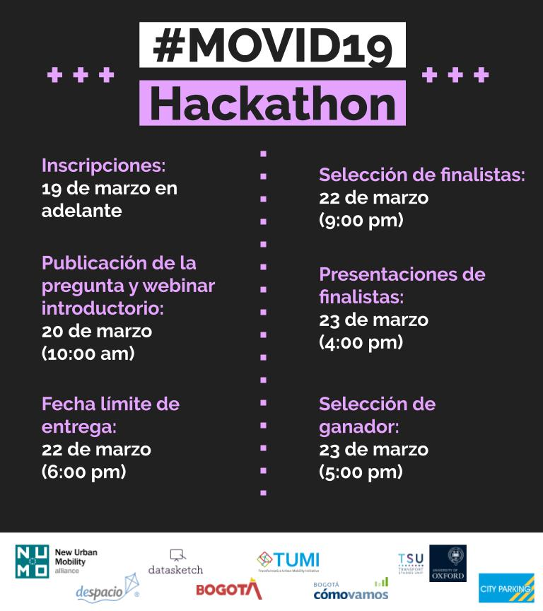

# MOVID19

Hackatón para buscar soluciones al reto del Covid-19 en transporte público.

## ¿Qué es?

Frente a la pandemia global de COVID-19 y el gran reto que ha supuesto prestar un buen servicio de transporte público sin incrementar el riesgo de contagio - y la coyuntura de tener toda una ciudad en cuarentena durante cuatro días, NUMO en alianza con Datasketch, Despacio y otras organizaciones quieren premiar las mejores soluciones que se presenten a través de un hackaton que se lanzará el jueves 19 de Marzo en la noche y se premiará el lunes 23 de marzo en la tarde.

Se espera que el análisis de los datos sobre COVID-19 y movilidad en Bogotá, puedan aportar soluciones para el **mejoramiento en la calidad del transporte en la ciudad durante la pandemia**. Y a su vez que la solución permita que la Secretaría Distrital de Movilidad de Bogotá pueda implementar estrategias adecuadas para enfrentar la crisis y monitorear la información relevante.

## ¿Cómo participar?

1. Regístrate [aquí](https://forms.gle/6vZzhihhDFNrWrzc7). Puedes participar en grupos de máximo 3 personas.
1. Clona el repositorio para quedar inscrito. [Ver instructivo](./faq/pull-request.md)
1. Hackea tu solución teniendo en cuenta la **pregunta principal** y la información de [inspiración](faq/inspiracion.md)
1. Envía tu solución a a la [pregunta]() haciendo un pull request incluyendo una carpeta con tu nombre de GitHub. Asegúrate de mantener la estructura descrita en el [instructivo.](./faq/estructura-de-archivos.md)

Te puedes inscribir en cualquier momento antes de la fecha límite de envío de soluciones descrita en el [cronograma](#cronograma)

## Pregunta

> Con análisis de datos y posibilidad de monitoreo de impacto, ¿qué intervenciones pueden implementarse para mejorar la movilidad de Bogotá, reducir la probabilidad de contagio de virus Covid-19 y focalizar el servicio a quienes irremediablemente deben usarlo?

A partir de análisis de datos que predigan un mejoramiento y permitan un monitoreo de su impacto positivo ¿Cómo se puede mejorar la calidad de la movilidad en Bogotá, reduciendo la probabilidad de contagio de virus Covid-19 e incrementando la facilidad para quienes obligatoriamente tienen que usar el servicio, principalmente personas que trabajan en el sector de salud? El gran reto es que el transporte público tiene finanzas muy “justas”, lo que hace difícil tomar medidas grandes como incrementar la flota sustancialmente. Otro reto es que no se puede dejar de prestar este servicio que es esencial y del cual depende una proporción muy alta de la ciudadanía, en particular muchas personas que prestan servicios que no se pueden realizar virtualmente. Un último reto es que no es viable promover el uso de modos como el automóvil pues el acceso a este es mucho menor (y si se comparte el automóvil se genera el mismo problema de contagio), y la bicicleta sí es muy efectiva pero no para toda la población (pues algunas personas viven muy lejos o no pueden andar en bicicleta). Los viajes en carro son poco eficientes y hay poca disponibilidad en la ciudad.

## Reglamento

Acá puede acceder al documento completo [pdf](/static/tyc-movid19.pdf) con los términos y condiciones. A continuación un resumen sobre los temas importantes.

### Reconocimiento

**1000 USD** 

Repartidos así entre los ganadores:

1. $950 USD al ganador
1. $250 USD al segundo lugar
1. $150 USD al tercer lugar

### Jurados

Carlos F Pardo, NUMO

Juan Pablo Marín Díaz, Datasketch

Maria Fernanda Ramírez, Despacio

Juan Pablo Orjuela, Oxford

### Criterios de evaluación

- Criterios de evaluación de proceso:
  - Apertura: Acceso abierto, colaboración.
  - Diseño: Gráfico de presentación de resultados.
  - Ciencia de datos: Metodología clara, flujos repiclables y reproducibles.
- Criterios de resultado:
  - Pertinencia: En movilidad y salud pública.
  - Viabilidad: Que el gobierno pudiese ejecutar las medidas al día siguiente.
  - Monitoreo: Que la efectividad de lo propuesto se pueda evaluar fácilmente.
  - Sostenibilidad: Que siga principios de transporte sostenible estándar en la literatura.

## Recursos y datos

En [esta página](faq/datos.md) estaremos publicando todos los datos que puedan ser relevantes para dar respuesta a la pregunta de la hackatón.

## Cronograma

Agrega este [calendario de Google](https://calendar.google.com/calendar?cid=bnVtby5nbG9iYWxfMmZlMnZtaHZmdGltdjdnaDhhZXVxMjJ0bm9AZ3JvdXAuY2FsZW5kYXIuZ29vZ2xlLmNvbQ)

Descarga Calendario [ics](/static/invite.ics)

**Inscripciones:** Desde el jueves 19 a las 6pm.

**Publicación pregunta y webinar introductorio**: Viernes 20 de marzo 10am.

**Fecha límite entrega de resultados:** Domingo 22 de marzo 6pm.

**Selección de finalistas:** Domingo 22 de marzo 9pm.

**Presentaciones de finalistas:** Lunes 23 de marzo 4pm.

**Anuncio ganadores**: Lunes 23 de marzo 5pm.

## Webinars y conversaciones

Durante la Hackaton estaremos teniendo conversaciones virtuales sobre temas relevantes. Estaremos actualizando la información aquí y desde las redes de [@datasketch](http://twitter.com/datasketch)

- Primer webinar. Lanzamiento e introducción. [Ver video - 31 mins](https://wri.zoom.us/rec/share/vdNqduvLzWNIXLOX8GLjCqQsN9j1eaa823VMrvQEyHeLDthKUTi5J2VgeJ39OBg)
- Segundo webinar. Carlos Pardo [Ver video - 58 mins](https://wri.zoom.us/rec/play/tZwkJuGuq2o3GoWXuASDAKd7W9W_Kqus0XVP_aUEnhuyUnkCY1DwMrVBNubPyK7Y8T0SamOnR-ZJ4XNe?startTime=1584731013000)
- Tercer webinar. Nicolás Estupiñán - Secretario de Movilidad. [Ver video - 20 mins](https://wri.zoom.us/rec/play/upEpdu78_Ts3G9WVtgSDVv95W9Toeq2s1XMc8_IPyk3mUiNVMFvyZuMQMedKvy_ElJZKFeFrtVDcpOc-?continueMode=true). [Leer notas](/faq/notas-webinars.md)
- Cuarto webinar. Juan Pablo Marín Díaz. Acceso a datos públicos con R. [Descargar video 1:00 hora 200 MB](https://data.datasketch.co/numo/movid19/webinars/meetup-r-movid19.mp4)
- Quinto webinar. Erik Vergel. Mapatones Bogotá. [Ver video 53 mins](https://wri.zoom.us/rec/play/6Zwqdriqpjg3H4WX4wSDAvMrW43oKPms1HVKqfoKn0m0BnFXNgH3NbsUZI4SHXgRYJeMfLZ8eLVrPi0?continueMode=true)
- Sexto webinar. Marina Troncoso y José Segundo López. [Ver video 57 mins](https://wri.zoom.us/rec/share/98pMbI3OrVxIGo2W9BzWd_Y7QKXrT6a81nAc-KZezp9FaQ4vJnIqo3CERKoxfic)

## Preguntas frecuentes

En [esta página](faq/README.md) puedes ver preguntas frecuentes sobre la Hackaton #MOVID19

## Kit de prensa

Si quieres ayudar a difundir consulta [esta página](faq/kit-prensa.md) con imágenes y textos para que invites a más gente a participar. 

## Organizaciones que apoyan

**[NUMO - New Urban Mobility Alliance](http://numo.global)** en alianza con **[Datasketch](https://datasketch.co)** 

[GIZ TUMI](http://transformative-mobility.org/)

[City Parking](https://city-parking.com/)

[Despacio](https://www.despacio.org/)

[Alcaldía Mayor de Bogotá](http://ticbogota.gov.co/)

[Bogotá Cómo Vamos](http://www.bogotacomovamos.org/)

[Transport Studies Unit, University of Oxford](https://www.tsu.ox.ac.uk) Juan Pablo Orjuela

[C40 Cities Finance Facility](https://www.c40cff.org)

Erik Vergel, Arquitectura UniAndes.

Alberto Prieto

Juan David García, Universidad Nacional.

Diego Pajarito Grajales, Instituto de Arquitectura Avanzada de Catalunya.

