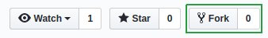
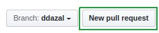
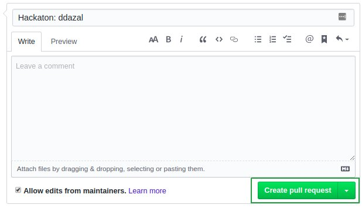

## Requisitos

Necesitas tener una cuenta en [GitHub](https://github.com/) y tener [git](https://git-scm.com/) instalado en tu computador.

## Haz un fork

Para crear una copia del repositorio en tu perfil debes hacer un fork. Basta con hacer clic en el botón de *Fork* ubicado en la parte superior derecha del repositorio.



Cuando el proceso haya finalizado podrás clonar el repositorio en tu computador utilizando la terminal

```bash
# Reemplaza tu_usuario por tu usuario de GitHub
git clone https://github.com/tu_usuario/MOVID19.git
```

## Hackea

### Crea una rama

Crea una rama con tu nombre de usuario

```bash
# Entra a la carpeta que clonaste
cd MOVID19

git checkout master

# Crea una rama con tu nombre de usuario
git checkout -b tu_usuario
```

Ya puedes empezar a hacer los cambios que quieras siguiendo la [estructura](./estructura-de-archivos.md) definida por los organizadores.

### Abre un pull request

Una vez hayas terminado y quieras subir los cambios para que los jurados evalúen tus resultados debes subir los cambios a tu copia en GitHub

```bash
git add .

git commit -m "Hackaton: tu_usuario"

git push origin tu_usuario
```

Navega hacia tu perfil de GitHub y busca el fork que creaste anteriormente. Haz clic en el botón de *Pull Request*



Verás un recuadro en donde podrás escribir más información sobre lo que hiciste. Al finalizar, envía tu pull request haciendo clic en el botón que se muestra en la imagen



¡Listo! Ya estás participando en la hackaton MOVID-19
