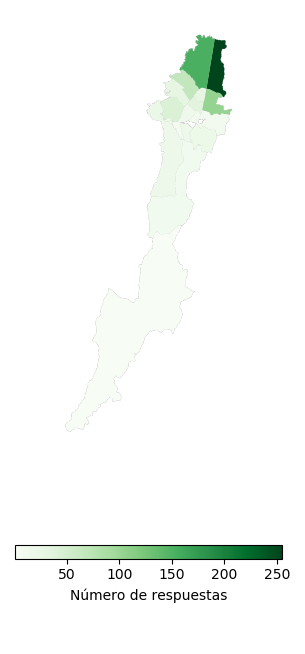
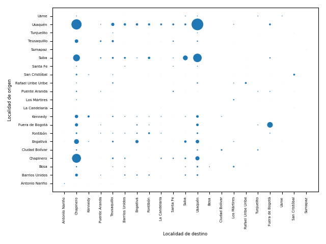
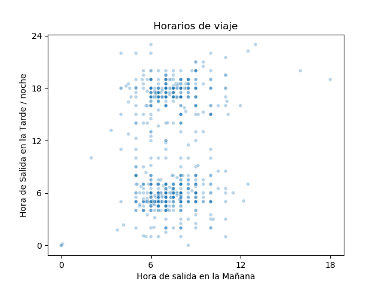
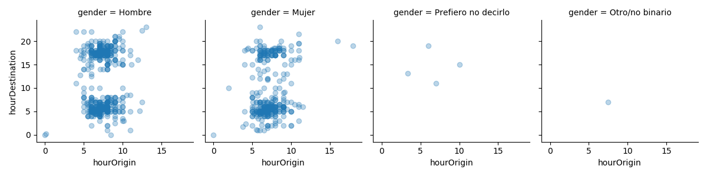
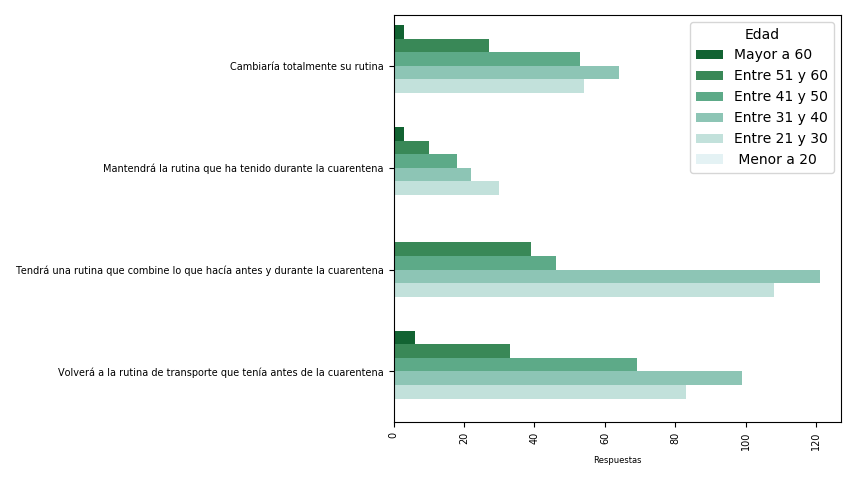
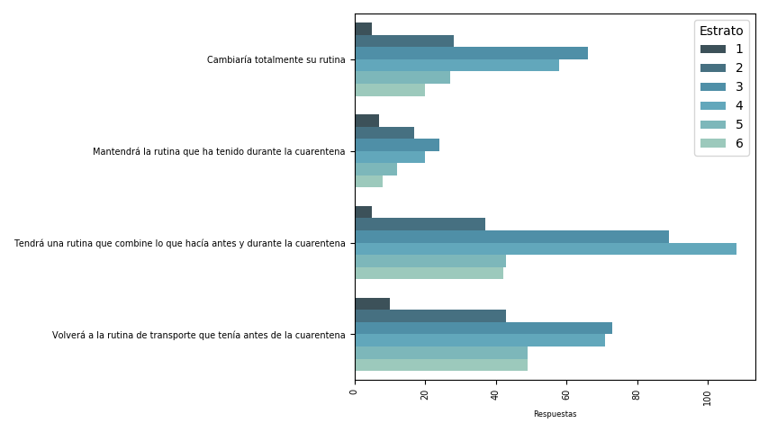
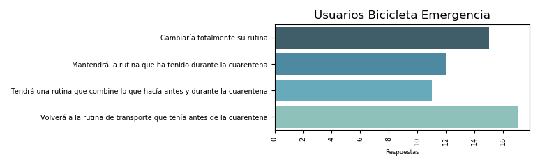

## Nombres

- Diego Pajarito

## Descripción Proyecto

Este es un ejercicio posterior a la Hackathon. Sin embargo, se relaciona íntimamente al usar datos resultado de una encuesta aplicada a usuarios de bicicletas compartidas. Estas bicicletas fueron asignadas como parte de la implementación de uno de los proyectos ganadores.

El proyecto hace una serie de visualizaciones sobre los patrones de viajes y características socioeconómicas en una muestra de más de 900 respuestas. Aunque no es posible extrapolar los resultados al nivel de ciudad por problemas de muestreo, si se encuentran patrones interesantes.

Finalmente, el proyecto busca aportar en métodos de visualización y representación de datos de movilidad. Mas allá de ser un estudio detallado de patrones de desplazamiento, aqui se compila el código fuente para generar gráficas de soporte al análisis.

## Resultados

[Algunos resultados se compartieron en un hilo de twitter](https://twitter.com/diegopajarito/status/1253937597929467904)

El trabajo onta de 5 scripts y dos carpetas:
- Scripts en python (Pandas y Seaborn) para:
    - Lectura de datos
    - Generación de un mapa con las respuestas por localidad
     
    
    
    - Una matriz origen/destino de los viajes
    
    
    
    - Gráficos de dispersión de puntos para horarios de viaje
    
    
    
    
    - Gráficos de barras para los cambios previstos en rutinas de transporte despues de la emergencia
    
     
    
- Las dos carpeta contienen los [datos de entrada](data) (encuesta y capa de localidades) y [los gráficos generados](plots)

[ ] Confirmo que la presentación de resultados sigue la plantilla presentada y está en formato PDF.

## Pasos metodología

1. Análisis de las necesidades de visualización para los resultados de la encueta
2. Exploración de datos y tipos de gráficos más adecuados
3. Ajustes a las gráficas
4. Socialización interna con equipo de expertos
5. Generación de gráficos finales
## Otros links relevantes
